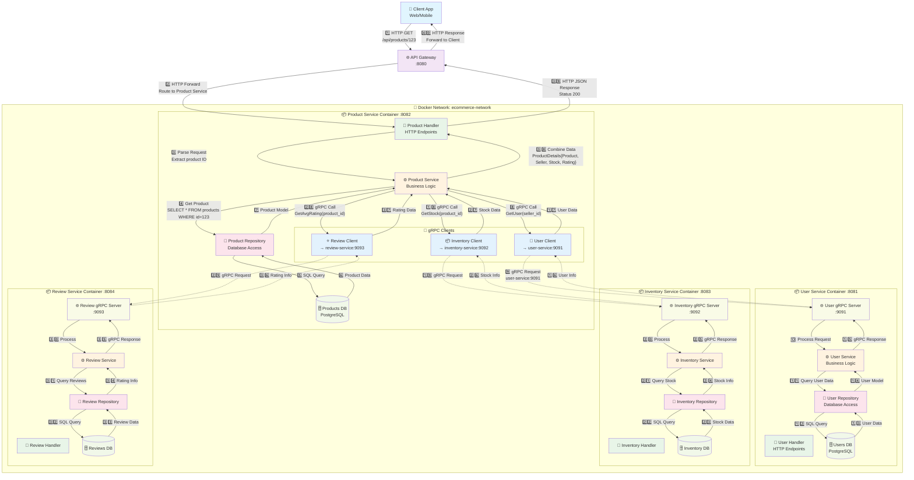

# 🛒 E-commerce Microservices Platform

A scalable e-commerce platform built with **Go microservices architecture**, designed for high performance and maintainability.

## 🚀 Features

- **Microservices Architecture**: 6 independent services with clear separation of concerns
- **API Gateway**: Centralized routing, authentication, and rate limiting
- **Event-Driven**: Asynchronous communication using message queues
- **Database per Service**: Each service has its own database for data isolation
- **Containerized**: Docker-ready with docker-compose for easy deployment
- **gRPC Communication**: High-performance inter-service communication
- **Clean Architecture**: Following Domain-Driven Design principles

## 🏗️ Architecture

```
┌─────────────────┐    ┌─────────────────┐    ┌─────────────────┐
│   Web Client    │    │   Mobile App    │    │  Admin Portal   │
└─────────┬───────┘    └─────────┬───────┘    └─────────┬───────┘
          │                      │                      │
          └──────────────────────┼──────────────────────┘
                                 │
                    ┌─────────────┴──────────────┐
                    │      API Gateway           │
                    │   (Authentication,         │
                    │    Rate Limiting)          │
                    └─────────────┬──────────────┘
                                  │
        ┌─────────────────────────┼─────────────────────────┐
        │                         │                         │
   ┌────▼────┐  ┌────▼────┐  ┌───▼────┐  ┌────▼────┐  ┌───▼────┐
   │  User   │  │Product  │  │ Order  │  │Payment  │  │Inventory│
   │Service  │  │Service  │  │Service │  │Service  │  │Service  │
   └─────────┘  └─────────┘  └────────┘  └─────────┘  └────────┘
        │            │           │           │            │
   ┌────▼────┐  ┌───▼────┐  ┌───▼────┐  ┌───▼────┐   ┌──▼────┐
   │PostgreSQL│  │PostgreSQL│ │PostgreSQL│ │PostgreSQL│ │PostgreSQL│
   └─────────┘  └────────┘  └────────┘  └────────┘   └───────┘
```


- Dưới đây là sơ đồ kiến trúc cho product-sevice:




## 🛠️ Tech Stack

### Backend
- **Language**: Go 1.24+
- **Framework**: Gin/Echo
- **Database**: PostgreSQL
- **Cache**: Redis
- **Message Queue**: RabbitMQ
- **Communication**: gRPC + HTTP REST
- **Container**: Docker + Docker Compose

### DevOps & Tools
- **API Documentation**: Swagger/OpenAPI
- **Testing**: Testify, Integration Tests
- **Monitoring**: Prometheus + Grafana
- **Logging**: Structured logging with Zap
- **Migration**: golang-migrate

## 📋 Services

| Service | Port | Description | Database |
|---------|------|-------------|----------|
| API Gateway | 8080 | Entry point, routing, auth | - |
| User Service | 8081 | User management, authentication | users_db |
| Product Service | 8082 | Product catalog, categories | products_db |
| Order Service | 8083 | Order processing, shopping cart | orders_db |
| Payment Service | 8084 | Payment processing, transactions | payments_db |
| Inventory Service | 8085 | Stock management | inventory_db |
| Notification Service | 8086 | Email, SMS notifications | notifications_db |

## 🚀 Quick Start

### Prerequisites
- Go 1.21 or higher
- Docker & Docker Compose
- PostgreSQL 14+
- Redis 6+

### ⚡ Phase 2: One-Command Start (Recommended)
```powershell
# Start all services and run tests
.\scripts\quick-start-phase2.ps1 -RunTests

# Just start services (no tests)
.\scripts\quick-start-phase2.ps1

# Stop all services
.\scripts\quick-start-phase2.ps1 -StopAll
```

This will:
1. ✅ Check Docker is running
2. ✅ Start infrastructure (PostgreSQL, Redis, RabbitMQ)
3. ✅ Run database migrations
4. ✅ Start all 7 microservices
5. ✅ Verify health of all services
6. ✅ Run automated tests (with `-RunTests` flag)

**See:** `docs/PHASE2_SUMMARY.md` for complete Phase 2 documentation

---

### Manual Setup (Alternative)

### 1. Clone the repository
```bash
git clone https://github.com/datngth03/ecommerce-go-app.git
cd ecommerce-go-app
```

### 2. Environment Setup
```bash
cp .env.example .env
# Edit .env with your configurations
```

### 3. Start Infrastructure
```bash
# Start databases, message queue, and monitoring
docker-compose up -d postgres redis rabbitmq
```

### 4. Database Migration
```bash
# Run migrations for all services
make migrate-up
```

### 5. Start Services
```bash
# Option 1: Using Docker (Recommended)
docker-compose up -d

# Option 2: Local development
cd services/api-gateway && go run cmd/main.go
```

### 6. Verify Installation
```bash
# Check API Gateway health
curl http://localhost:8000/health

# Check individual services
curl http://localhost:8001/health  # User Service
curl http://localhost:8002/health  # Product Service
curl http://localhost:8003/health  # Order Service
curl http://localhost:8004/health  # Notification Service
curl http://localhost:8005/health  # Inventory Service
curl http://localhost:8006/health  # Payment Service
```

## 📚 API Documentation

### 🎯 Phase 2: Complete Testing Suite

**Quick Start:**
```powershell
# Run automated tests
.\tests\e2e\test-api.ps1

# Or use quick start with tests
.\scripts\quick-start-phase2.ps1 -RunTests
```

**Documentation:**
- **Complete Test Guide**: `docs/PHASE2_TESTING.md` - All test scenarios with curl examples
- **Phase 2 Summary**: `docs/PHASE2_SUMMARY.md` - Overview of testing infrastructure
- **Postman Collection**: `docs/api/postman/ecommerce-phase2.postman_collection.json` - 40+ endpoints

**Test Coverage:**
- ✅ User Service (Register, Login, Profile)
- ✅ Product Service (CRUD operations)
- ✅ Inventory Service (Stock management)
- ✅ Order Service (Cart, Orders)
- ✅ Payment Service (Process, Confirm, Refund)
- ✅ End-to-End E-Commerce Flow

---

### Swagger UI
- **API Gateway**: http://localhost:8000/swagger/ (Coming soon)
- **Individual Services**: http://localhost:800X/swagger/ (Coming soon)

### Postman Collection
Import `docs/api/postman/ecommerce-phase2.postman_collection.json` for testing all APIs.

**How to use:**
1. Import collection into Postman
2. Run "Register User" → Auto-saves user_id
3. Run "Login" → Auto-saves access_token
4. All subsequent requests use the token automatically
5. Follow the numbered folders (1. User Service → 5. Payment Service)

## 🧪 Testing

### ⚡ Automated Testing (Phase 2)
```powershell
# Run complete automated test suite (20+ tests)
.\tests\e2e\test-api.ps1

# Expected output:
# ✅ User Service (3 tests)
# ✅ Product Service (3 tests)
# ✅ Inventory Service (2 tests)
# ✅ Order Service (5 tests)
# ✅ Payment Service (6 tests)
# ✅ Inventory Verification (1 test)
# 
# 📊 Test Summary
# Total Tests: 20
# Passed: 20
# Failed: 0
# Pass Rate: 100%
```

**See:** `docs/PHASE2_TESTING.md` for detailed test scenarios

### Unit Tests
```bash
# Run tests for all services
make test

# Run tests for specific service
cd services/user-service && go test ./...
```

### Integration Tests
```bash
# Start test environment
make test-env-up

# Run integration tests
make test-integration
```

### Load Testing
```bash
# Using K6
k6 run tests/load/k6/load_test.js
```

## 📊 Monitoring

### Prometheus Metrics
- **URL**: http://localhost:9090
- **Metrics**: Request duration, error rates, database connections

### Grafana Dashboards
- **URL**: http://localhost:3000
- **Default Login**: admin/admin
- **Dashboards**: Service metrics, business metrics

### Application Logs
```bash
# View logs for all services
docker-compose logs -f

# View logs for specific service
docker-compose logs -f user-service
```

## 🔧 Development

### Project Structure
```
ecommerce-microservices/
├── services/           # Microservices
├── shared/            # Shared libraries
├── infrastructure/    # Docker, K8s configs
├── docs/             # Documentation
└── scripts/          # Build and deployment scripts
```

### Adding a New Service
1. Create service directory in `services/`
2. Follow the established structure (cmd, internal, pkg)
3. Add to docker-compose.yml
4. Update API Gateway routing
5. Add monitoring and documentation

### Code Standards
- Follow Go conventions and best practices
- Use dependency injection
- Implement proper error handling
- Write comprehensive tests
- Document APIs with Swagger

## 📱 Client Applications

The backend provides RESTful APIs that can be consumed by:
- **Web Applications** (React, Vue.js, Angular)
- **Mobile Apps** (React Native, Flutter)
- **Desktop Applications** (Electron)
- **Third-party Integrations**

### Example API Calls

**See complete examples in:** `docs/PHASE2_TESTING.md`

```powershell
# User Registration
curl -X POST http://localhost:8000/api/v1/auth/register `
  -H "Content-Type: application/json" `
  -d '{"email":"user@example.com","password":"SecurePass123!","username":"user","full_name":"User Name"}'

# Login
curl -X POST http://localhost:8000/api/v1/auth/login `
  -H "Content-Type: application/json" `
  -d '{"email":"user@example.com","password":"SecurePass123!"}'

# Get Products (Public)
curl http://localhost:8000/api/v1/products?page=1&page_size=10

# Get Profile (Authenticated)
curl http://localhost:8000/api/v1/users/me `
  -H "Authorization: Bearer YOUR_TOKEN"

# Add to Cart
curl -X POST http://localhost:8000/api/v1/cart `
  -H "Content-Type: application/json" `
  -H "Authorization: Bearer YOUR_TOKEN" `
  -d '{"product_id":1,"quantity":2,"price":99.99}'

# Create Order
curl -X POST http://localhost:8000/api/v1/orders `
  -H "Content-Type: application/json" `
  -H "Authorization: Bearer YOUR_TOKEN" `
  -d '{"shipping_address":"123 Main St","payment_method":"stripe"}'

# Process Payment
curl -X POST http://localhost:8000/api/v1/payments `
  -H "Content-Type: application/json" `
  -H "Authorization: Bearer YOUR_TOKEN" `
  -d '{"order_id":"1","amount":199.98,"method":"stripe","currency":"USD"}'
```

**For complete API reference with 40+ endpoints, see:**
- `docs/PHASE2_TESTING.md` - Complete curl examples
- `docs/api/postman/ecommerce-phase2.postman_collection.json` - Postman collection
curl -X GET http://localhost:8080/api/v1/products?page=1&limit=10

# Create Order
curl -X POST http://localhost:8080/api/v1/orders \
  -H "Authorization: Bearer YOUR_JWT_TOKEN" \
  -H "Content-Type: application/json" \
  -d '{"items":[{"product_id":1,"quantity":2}]}'
```

## 🚀 Deployment

### Docker Production
```bash
# Build all services
make build-docker

# Deploy to production
docker-compose -f docker-compose.prod.yml up -d
```

### Kubernetes
```bash
# Apply Kubernetes manifests
kubectl apply -f infrastructure/k8s/
```

### Environment Variables
Key environment variables for production:
```bash
# Database
DB_HOST=your-postgres-host
DB_PASSWORD=your-secure-password

# JWT
JWT_SECRET=your-jwt-secret

# Payment
STRIPE_SECRET_KEY=your-stripe-key

# Notification
SMTP_PASSWORD=your-smtp-password
```

## 🤝 Contributing

1. Fork the repository
2. Create a feature branch (`git checkout -b feature/amazing-feature`)
3. Commit your changes (`git commit -m 'Add amazing feature'`)
4. Push to the branch (`git push origin feature/amazing-feature`)
5. Open a Pull Request

### Development Workflow
- Follow Git Flow branching model
- Write tests for new features
- Update documentation
- Ensure all CI checks pass

## 📜 License

This project is licensed under the MIT License - see the [LICENSE](LICENSE) file for details.

## 👨‍💻 Author

**Your Name**
- GitHub: [@your-username](https://github.com/datngth03)
- LinkedIn: [Your LinkedIn](https://linkedin.com/in/datngth9903)
- Email: datnt9903@gmail.com

## 🙏 Acknowledgments

- Go community for excellent libraries and tools
- Microservices patterns from industry best practices
- Clean Architecture principles by Robert C. Martin

---

⭐ **Star this repository if you find it helpful!**

## 📈 Project Status

- ✅ **MVP**: Core e-commerce functionality
- 🚧 **In Progress**: Advanced analytics, recommendation engine
- 📋 **Planned**: Multi-tenant support, advanced search

**Last Updated**: September 2025