# 🛒 E-commerce Microservices Platform

A scalable e-commerce platform built with **Go microservices architecture**, designed for high performance and maintainability.

## 🚀 Features

- **Microservices Architecture**: 6 independent services with clear separation of concerns
- **API Gateway**: Centralized routing, authentication, and rate limiting
- **Event-Driven**: Asynchronous communication using message queues
- **Database per Service**: Each service has its own database for data isolation
- **Containerized**: Docker-ready with docker-compose for easy deployment
- **gRPC Communication**: High-performance inter-service communication
- **Clean Architecture**: Following Domain-Driven Design principles

## 🏗️ Architecture

```
┌─────────────────┐    ┌─────────────────┐    ┌─────────────────┐
│   Web Client    │    │   Mobile App    │    │  Admin Portal   │
└─────────┬───────┘    └─────────┬───────┘    └─────────┬───────┘
          │                      │                      │
          └──────────────────────┼──────────────────────┘
                                 │
                    ┌─────────────┴──────────────┐
                    │      API Gateway           │
                    │   (Authentication,         │
                    │    Rate Limiting)          │
                    └─────────────┬──────────────┘
                                  │
        ┌─────────────────────────┼─────────────────────────┐
        │                         │                         │
   ┌────▼────┐  ┌────▼────┐  ┌───▼────┐  ┌────▼────┐  ┌───▼────┐
   │  User   │  │Product  │  │ Order  │  │Payment  │  │Inventory│
   │Service  │  │Service  │  │Service │  │Service  │  │Service  │
   └─────────┘  └─────────┘  └────────┘  └─────────┘  └────────┘
        │            │           │           │            │
   ┌────▼────┐  ┌───▼────┐  ┌───▼────┐  ┌───▼────┐   ┌──▼────┐
   │PostgreSQL│  │PostgreSQL│ │PostgreSQL│ │PostgreSQL│ │PostgreSQL│
   └─────────┘  └────────┘  └────────┘  └────────┘   └───────┘
```

# 🏗️ Hệ thống E-commerce Microservices

Dưới đây là sơ đồ kiến trúc cho product-sevice:

```mermaid
graph TB
    %% External Layer
    Client[📱 Client App<br/>Web/Mobile]
    Gateway[🌐 API Gateway<br/>:8080]
    
    %% Docker Network
    subgraph DockerNetwork["🐳 Docker Network: ecommerce-network"]
        %% Product Service Container
        subgraph ProductContainer["📦 Product Service Container :8082"]
            PH[🔄 Product Handler<br/>HTTP Endpoints]
            PS[⚙️ Product Service<br/>Business Logic]
            PR[💾 Product Repository<br/>Database Access]
            PDB[(🗄️ Products DB<br/>PostgreSQL)]
            
            %% gRPC Clients in Product Service
            subgraph PClients["📡 gRPC Clients"]
                UC[👤 User Client<br/>→ user-service:9091]
                IC[📦 Inventory Client<br/>→ inventory-service:9092]
                RC[⭐ Review Client<br/>→ review-service:9093]
            end
        end
        
        %% User Service Container
        subgraph UserContainer["📦 User Service Container :8081"]
            UH[🔄 User Handler<br/>HTTP Endpoints]
            US[⚙️ User Service<br/>Business Logic]
            UR[💾 User Repository<br/>Database Access]
            UDB[(🗄️ Users DB<br/>PostgreSQL)]
            
            %% gRPC Server in User Service
            UGS[🌐 User gRPC Server<br/>:9091]
        end
        
        %% Inventory Service Container
        subgraph InventoryContainer["📦 Inventory Service Container :8083"]
            IH[🔄 Inventory Handler]
            IS[⚙️ Inventory Service]
            IR[💾 Inventory Repository]
            IDB[(🗄️ Inventory DB)]
            IGS[🌐 Inventory gRPC Server<br/>:9092]
        end
        
        %% Review Service Container
        subgraph ReviewContainer["📦 Review Service Container :8084"]
            RH[🔄 Review Handler]
            RS[⚙️ Review Service]
            RR[💾 Review Repository]
            RDB[(🗄️ Reviews DB)]
            RGS[🌐 Review gRPC Server<br/>:9093]
        end
    end
    
    %% HTTP Flow (External)
    Client -->|"1️⃣ HTTP GET<br/>/api/products/123"| Gateway
    Gateway -->|"2️⃣ HTTP Forward<br/>Route to Product Service"| PH
    
    %% Within Product Service
    PH -->|"3️⃣ Parse Request<br/>Extract product ID"| PS
    PS -->|"4️⃣ Get Product<br/>SELECT * FROM products WHERE id=123"| PR
    PR -->|"5️⃣ SQL Query"| PDB
    PDB -->|"6️⃣ Product Data"| PR
    PR -->|"7️⃣ Product Model"| PS
    
    %% gRPC Inter-Service Communication
    PS -->|"8️⃣ gRPC Call<br/>GetUser(seller_id)"| UC
    UC -.->|"9️⃣ gRPC Request<br/>user-service:9091"| UGS
    UGS -->|"🔟 Process Request"| US
    US -->|"1️⃣1️⃣ Query User Data"| UR
    UR -->|"1️⃣2️⃣ SQL Query"| UDB
    UDB -->|"1️⃣3️⃣ User Data"| UR
    UR -->|"1️⃣4️⃣ User Model"| US
    US -->|"1️⃣5️⃣ gRPC Response"| UGS
    UGS -.->|"1️⃣6️⃣ User Info"| UC
    UC -->|"1️⃣7️⃣ User Data"| PS
    
    %% More gRPC calls
    PS -->|"1️⃣8️⃣ gRPC Call<br/>GetStock(product_id)"| IC
    IC -.->|"1️⃣9️⃣ gRPC Request"| IGS
    IGS -->|"2️⃣0️⃣ Process"| IS
    IS -->|"2️⃣1️⃣ Query Stock"| IR
    IR -->|"2️⃣2️⃣ SQL Query"| IDB
    IDB -->|"2️⃣3️⃣ Stock Data"| IR
    IR -->|"2️⃣4️⃣ Stock Info"| IS
    IS -->|"2️⃣5️⃣ gRPC Response"| IGS
    IGS -.->|"2️⃣6️⃣ Stock Info"| IC
    IC -->|"2️⃣7️⃣ Stock Data"| PS
    
    PS -->|"2️⃣8️⃣ gRPC Call<br/>GetAvgRating(product_id)"| RC
    RC -.->|"2️⃣9️⃣ gRPC Request"| RGS
    RGS -->|"3️⃣0️⃣ Process"| RS
    RS -->|"3️⃣1️⃣ Query Reviews"| RR
    RR -->|"3️⃣2️⃣ SQL Query"| RDB
    RDB -->|"3️⃣3️⃣ Review Data"| RR
    RR -->|"3️⃣4️⃣ Rating Info"| RS
    RS -->|"3️⃣5️⃣ gRPC Response"| RGS
    RGS -.->|"3️⃣6️⃣ Rating Info"| RC
    RC -->|"3️⃣7️⃣ Rating Data"| PS
    
    %% Response Flow
    PS -->|"3️⃣8️⃣ Combine Data<br/>ProductDetails{Product, Seller, Stock, Rating}"| PH
    PH -->|"3️⃣9️⃣ HTTP JSON Response<br/>Status 200"| Gateway
    Gateway -->|"4️⃣0️⃣ HTTP Response<br/>Forward to Client"| Client
    
    %% Styling
    classDef client fill:#e1f5fe
    classDef gateway fill:#f3e5f5
    classDef handler fill:#e8f5e8
    classDef service fill:#fff3e0
    classDef repository fill:#fce4ec
    classDef database fill:#f1f8e9
    classDef grpcClient fill:#e3f2fd
    classDef grpcServer fill:#f9fbe7
    classDef container fill:#f5f5f5,stroke:#333,stroke-width:2px
    
    class Client client
    class Gateway gateway
    class PH,UH,IH,RH handler
    class PS,US,IS,RS service
    class PR,UR,IR,RR repository
    class PDB,UDB,IDB,RDB database
    class UC,IC,RC grpcClient
    class UGS,IGS,RGS grpcServer
```




## 🛠️ Tech Stack

### Backend
- **Language**: Go 1.21+
- **Framework**: Gin/Echo
- **Database**: PostgreSQL
- **Cache**: Redis
- **Message Queue**: RabbitMQ
- **Communication**: gRPC + HTTP REST
- **Container**: Docker + Docker Compose

### DevOps & Tools
- **API Documentation**: Swagger/OpenAPI
- **Testing**: Testify, Integration Tests
- **Monitoring**: Prometheus + Grafana
- **Logging**: Structured logging with Zap
- **Migration**: golang-migrate

## 📋 Services

| Service | Port | Description | Database |
|---------|------|-------------|----------|
| API Gateway | 8080 | Entry point, routing, auth | - |
| User Service | 8081 | User management, authentication | users_db |
| Product Service | 8082 | Product catalog, categories | products_db |
| Order Service | 8083 | Order processing, shopping cart | orders_db |
| Payment Service | 8084 | Payment processing, transactions | payments_db |
| Inventory Service | 8085 | Stock management | inventory_db |
| Notification Service | 8086 | Email, SMS notifications | notifications_db |

## 🚀 Quick Start

### Prerequisites
- Go 1.21 or higher
- Docker & Docker Compose
- PostgreSQL 14+
- Redis 6+

### 1. Clone the repository
```bash
git clone https://github.com/your-username/ecommerce-microservices.git
cd ecommerce-microservices
```

### 2. Environment Setup
```bash
cp .env.example .env
# Edit .env with your configurations
```

### 3. Start Infrastructure
```bash
# Start databases, message queue, and monitoring
docker-compose up -d postgres redis rabbitmq prometheus grafana
```

### 4. Database Migration
```bash
# Run migrations for all services
make migrate-up
```

### 5. Start Services
```bash
# Option 1: Using Docker (Recommended)
docker-compose up

# Option 2: Local development
make run-all
```

### 6. Verify Installation
```bash
# Check API Gateway health
curl http://localhost:8080/health

# Check individual services
curl http://localhost:8081/health  # User Service
curl http://localhost:8082/health  # Product Service
```

## 📚 API Documentation

### Swagger UI
- **API Gateway**: http://localhost:8080/swagger/
- **Individual Services**: http://localhost:808X/swagger/

### Postman Collection
Import `docs/api/postman/ecommerce.postman_collection.json` for testing APIs.

## 🧪 Testing

### Unit Tests
```bash
# Run tests for all services
make test

# Run tests for specific service
cd services/user-service && go test ./...
```

### Integration Tests
```bash
# Start test environment
make test-env-up

# Run integration tests
make test-integration
```

### Load Testing
```bash
# Using K6
k6 run tests/load/k6/load_test.js
```

## 📊 Monitoring

### Prometheus Metrics
- **URL**: http://localhost:9090
- **Metrics**: Request duration, error rates, database connections

### Grafana Dashboards
- **URL**: http://localhost:3000
- **Default Login**: admin/admin
- **Dashboards**: Service metrics, business metrics

### Application Logs
```bash
# View logs for all services
docker-compose logs -f

# View logs for specific service
docker-compose logs -f user-service
```

## 🔧 Development

### Project Structure
```
ecommerce-microservices/
├── services/           # Microservices
├── shared/            # Shared libraries
├── infrastructure/    # Docker, K8s configs
├── docs/             # Documentation
└── scripts/          # Build and deployment scripts
```

### Adding a New Service
1. Create service directory in `services/`
2. Follow the established structure (cmd, internal, pkg)
3. Add to docker-compose.yml
4. Update API Gateway routing
5. Add monitoring and documentation

### Code Standards
- Follow Go conventions and best practices
- Use dependency injection
- Implement proper error handling
- Write comprehensive tests
- Document APIs with Swagger

## 📱 Client Applications

The backend provides RESTful APIs that can be consumed by:
- **Web Applications** (React, Vue.js, Angular)
- **Mobile Apps** (React Native, Flutter)
- **Desktop Applications** (Electron)
- **Third-party Integrations**

### Example API Calls
```bash
# User Registration
curl -X POST http://localhost:8080/api/v1/auth/register \
  -H "Content-Type: application/json" \
  -d '{"email":"user@example.com","password":"password123"}'

# Get Products
curl -X GET http://localhost:8080/api/v1/products?page=1&limit=10

# Create Order
curl -X POST http://localhost:8080/api/v1/orders \
  -H "Authorization: Bearer YOUR_JWT_TOKEN" \
  -H "Content-Type: application/json" \
  -d '{"items":[{"product_id":1,"quantity":2}]}'
```

## 🚀 Deployment

### Docker Production
```bash
# Build all services
make build-docker

# Deploy to production
docker-compose -f docker-compose.prod.yml up -d
```

### Kubernetes
```bash
# Apply Kubernetes manifests
kubectl apply -f infrastructure/k8s/
```

### Environment Variables
Key environment variables for production:
```bash
# Database
DB_HOST=your-postgres-host
DB_PASSWORD=your-secure-password

# JWT
JWT_SECRET=your-jwt-secret

# Payment
STRIPE_SECRET_KEY=your-stripe-key

# Notification
SMTP_PASSWORD=your-smtp-password
```

## 🤝 Contributing

1. Fork the repository
2. Create a feature branch (`git checkout -b feature/amazing-feature`)
3. Commit your changes (`git commit -m 'Add amazing feature'`)
4. Push to the branch (`git push origin feature/amazing-feature`)
5. Open a Pull Request

### Development Workflow
- Follow Git Flow branching model
- Write tests for new features
- Update documentation
- Ensure all CI checks pass

## 📜 License

This project is licensed under the MIT License - see the [LICENSE](LICENSE) file for details.

## 👨‍💻 Author

**Your Name**
- GitHub: [@your-username](https://github.com/datngth03)
- LinkedIn: [Your LinkedIn](https://linkedin.com/in/datngth9903)
- Email: datnt9903@gmail.com

## 🙏 Acknowledgments

- Go community for excellent libraries and tools
- Microservices patterns from industry best practices
- Clean Architecture principles by Robert C. Martin

---

⭐ **Star this repository if you find it helpful!**

## 📈 Project Status

- ✅ **MVP**: Core e-commerce functionality
- 🚧 **In Progress**: Advanced analytics, recommendation engine
- 📋 **Planned**: Multi-tenant support, advanced search

**Last Updated**: September 2025